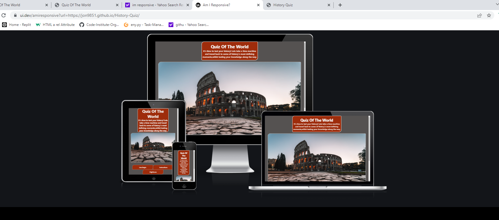
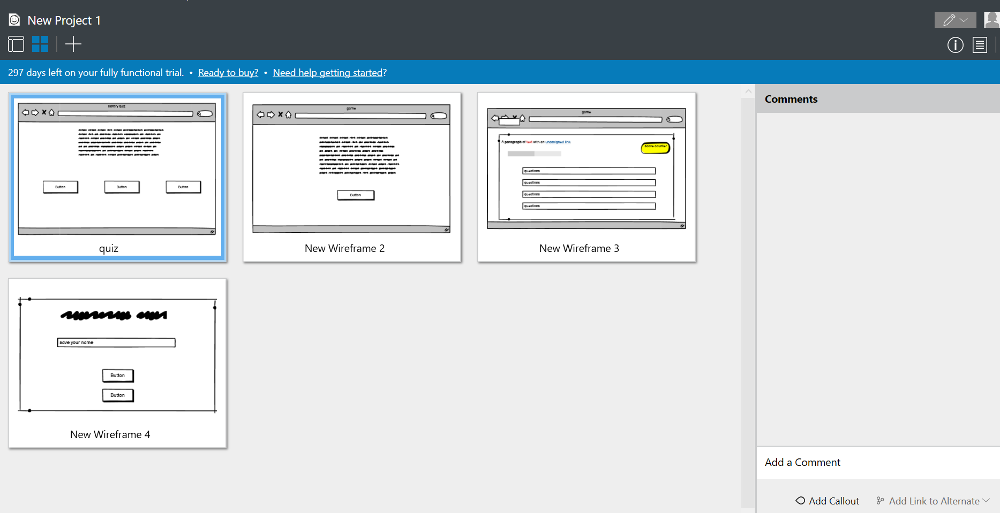
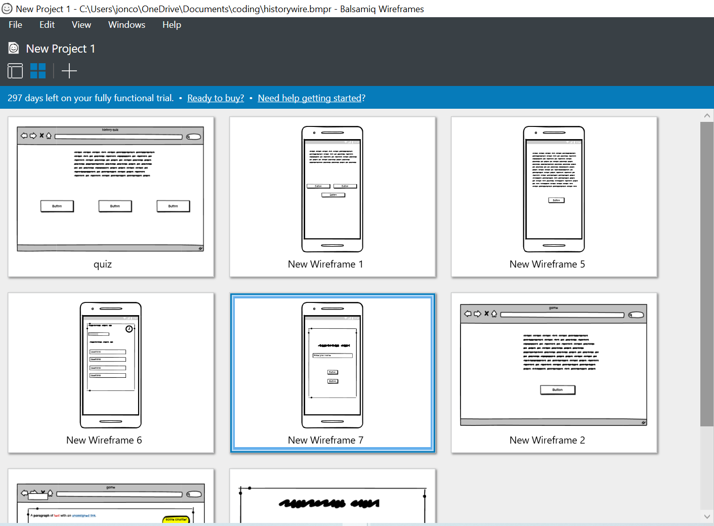
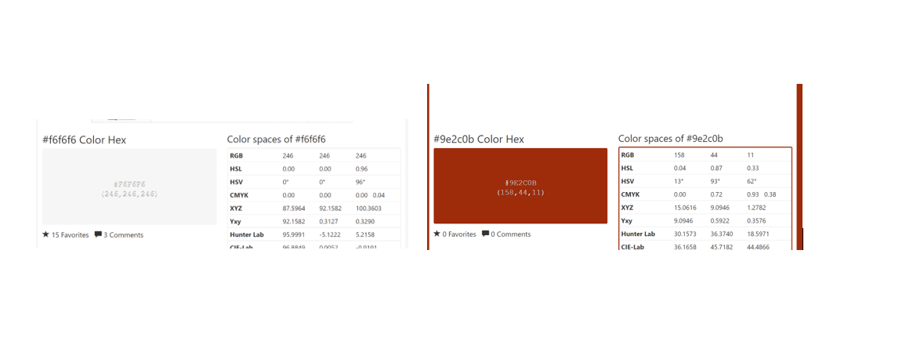
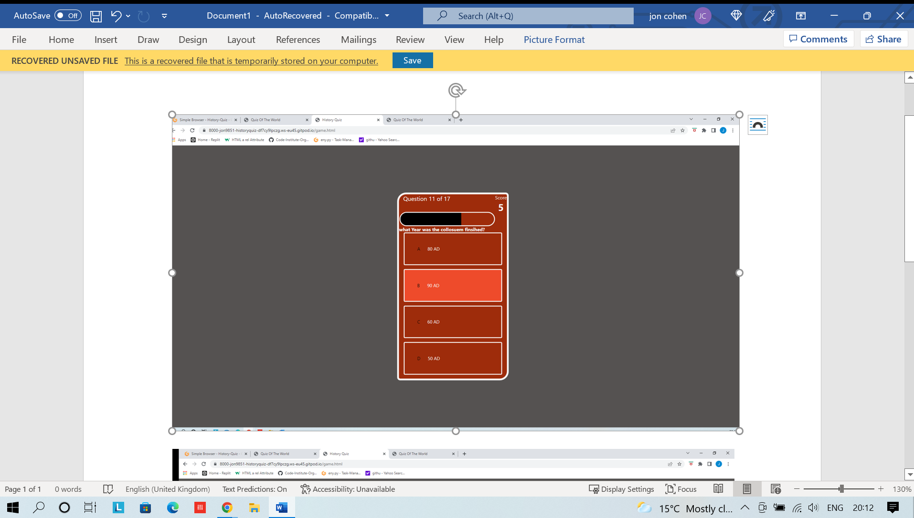
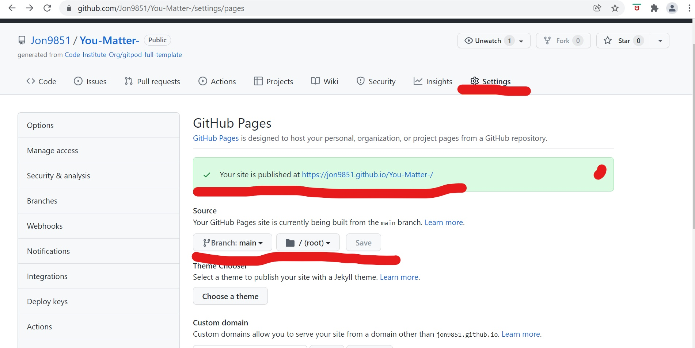

**_History Quiz_**
All credit for the html code desgin and javascrpit code goes to [Brian Codex](https://github.com/briancodex/quiz-app-js).

Welcome to the history quiz, this quiz will test your knowledge on world history through out many different centuries of our history. 

Being a big fan of history and im always keen on learning as much as I can this why I choose to do a history quiz. We can learn so much from history and it is our jobs to pass this knowledge. Winston Churchill famously said, “Those that fail to learn from history are doomed to repeat it”. 

After doing hours of research on what to do for my second project I kept coming across, the same results on the top 10 JavaScript projects for beginners and a quiz was in 90% of these this why I choose to build a quiz. 

Welcome to your guide through History Quiz <a href="https://jon9851.github.io/History-Quiz/" target="_blank" rel="noopner">History Quiz</a>

# Contents

* [**User Experience UX**](<#user-experience-ux>)
   * [User Stories](<#user-stories>)
   * [**Wireframes**](<#wireframes>)
   * [**Design Choices**](<#design-choices>)
       * [Color Scheme](<#color-scheme>)
   * [**Features**](<#features>)
       * [Home](<#Home>)
       * [Insturctions](<#Instructions>)
       * [Game](<#Game>)
       * [Score](<#Score>)
       * [Buttons](<#Buttons>)
* [**Future Features**](<#future-features>)
* [**Technologies Used**](<#Technologies-Used>)
* [**Testing**](<#testing>)
* [**Deployment**](<#deployment>)
* [**Credits**](<#credits>)
* [**Content**](<#content>)
* [**Future Features**](<Future-Features>)
* [**Acknowledgements**](<#acknowledgements>)                

# User Experience (UX)

## User stories

 ### First time Vistor Goals 
1. I want a quiz that provides rules and instructions on how to play the game.
2. I would like to know where abouts on the page im on.
3. I want to be able to play the game either on laptop or on my phone. 

 ### Returning Vistor Goals   
1. I would have liked to see the correct answer appear in a different colour so that i knew what the answer was to the question.
2. The quiz seemed slow on my phone, changing questions wasn`t instant and took a few seconds to switch.

 ### Frequent User Goals
1. I would have like the questions to appear randomised every time I play so I am not answering the same questions every time I play.
2. I would like to have feedback on the questions i got correct or incorrect, some kind of idenifcation of the correct or incorrect answers would be greatly appreciated.

### User Feedback
Having reviewed the user goals i have implemented changes to the quiz game. This will satisfy all types of user whether your a first time user or a returning one.

# Wireframes
The wireframes for ‘You Matter’ were produced in[Balsamiq](https://balsamiq.com).
There are frames for a full width display ( 1920 x 1080 )and a small mobile 
device (360 x 640). The final site varies slightly from the wireframes due to bugs and design 
changes during development that occurred during the creation process.
 

[Contents](<#contents>)

# Design Choices
 When designing the quiz of the world I wanted the quiz game to be simple and educational. The index page contains a brief introduction to the game, with three buttons directly underneath introduction paragraph. 
 
 A feature that I knew I was implementing early on was highlight option so that the user knew exactly where they where on the page and what buttons they were clicking. The quiz itself is a multiple-choice quiz as I knew the some of the question might be a bit difficult. Included in the game is a progress bar and a score counter so that the user can keep an eye on there score while playing the game.
 
 I hope that the users take away a bit of knowledge form playing the quiz of the world.

 THe colors that where choosen for the history quiz are displayed in image above.

 Red Copper with a hex code of #9e2c0b was used for text, backgorund and hoover effects.(Red- Copper colour)

 White smoke with a hex code of #f6f6f6 was used text, backgorund and hoover effects.(White Smoke)

  

[Contents](<#contents>)

# Features
### Home
The quiz of the world is a simple quiz game that contains 3 buttons on the home page. Each button will take user to three different pages. The buttons will be highlighted once the user clicked on them, this so that the user and keep track of which page they are on.

### Instructions
The instructions page contains a summary of the games rules as well as button to return home.

### Game
The game contains multiple different features which are designed to help the user while playing the quiz of the world.

1.	Located on the top left is a question counter to help the user keep track of what question they are up too.
2.	Below the question counter is a progress bar which fills up as the user progress through the quiz.
3.	Located on the top right is a score counter which will help the user keep track of the scores. 
4.	THe questions are displayed below the progress bar and change at random once a question has been answered.
5.	The quiz it is self is a multiple-choice quiz with four possible answers with 17 questions in total.
6.	Each option will change colour once selected. 

### Score
The score page has a line of text and a name box as well as two buttons which will either restart the quiz or take the user back to the home page. 

[Contents](<#contents>)

## Deployment

  ### **Deployment**

  The site was deployed using GitHub. THe following step will depoly You matter site.
  1. on the github repository, naviagte to **Settings** tab.
  2. Once on setting page, naviagte to **Pages** on the left hand side of the screen second from the bottom.
  3. Under **Source**, select the branch to **main**, then click **save**.
  4.  once you have selected the main branch, the page will be automatically refreshed with a detailed ribbon display to indicate the successful deployment. 
 
 
 
 # Technologies Used
   
* [HTML5](https://html.spec.whatwg.org/) -Used to create the contents and structure for the website.
* [CSS](https://www.w3.org/Style/CSS/Overview.en.html) -Used to create the styling.
* [Balsamiq](https://balsamiq.com/wireframes/) - Used to create the wireframes.
* [Gitpod](https://www.gitpod.io/#get-started) - Used to deploy the website.
* [Github](https://github.com/) - Used to host and edit the website code.
* [Code Beautify](https://codebeautify.org/jsvalidate) - To test and run the code
* [W3 Schools](https://validator.w3.org/)- To test the html and css code.
* [JavaScript (ES6)](https://open-vsx.gitpod.io/vscode/item?itemName=xabikos.JavaScriptSnippets)
* [ami responsive design](http://ami.responsivedesign.is) - To test out responsiness all devices

[Contents](<#contents>)

# Testing
 Please refer to [**_here_**](TESTING.md) for more information on testing 'Quiz Of The World'.

The live link will take you directly to **History Quiz** repository - https://github.com/Jon9851/History-Quiz
  
  # Clone  Repository
   To Clone a repository use the following steps to guide you throught it.
   1. Under the repository’s name, click on the code tab.
   2. click on the clipboard icon to copy the given URL.
   3. In your IDE of choice, open Git Bash.
   4. Change the current working directory to the location where you want the cloned directory to be made.
   5. Type git clone, and then paste the URL copied from GitHub.
   6. Press enter and the local clone will be created.

   

[Contents](<#contents>)

### Credits
1. W3schools- I used their tutorials on HTML and CSS for further understanding and troubleshooting  throughout my project.
2. Stack Overflow- I used Stack Overflow to get a more in depth understanding on HTML and CSS throughout my project.
3. Code Institute Example of the READ.MD- I used these as template when planning and writing my README file.
4.Code Institute tutors that helped me during my project.

[Contents](<#contents>)

# Acknowledgements
 
 The site was cerated for my milestone project 1 for the [Code Institute](https://codeinstitute.net/) Full Stack Software Developer diploma. I would like to thank all the tutors at the code institute for their help during the development of my first milestone project. I would aslo like to thank [Precious Ijege](https://www.linkedin.com/in/precious-ijege-908a00168/) for his guidence and help as his feedback was extremely key in completing my first milestone project.
 Brain Codex for help during the creation process. [Brian Codex](https://github.com/briancodex/quiz-app-js)