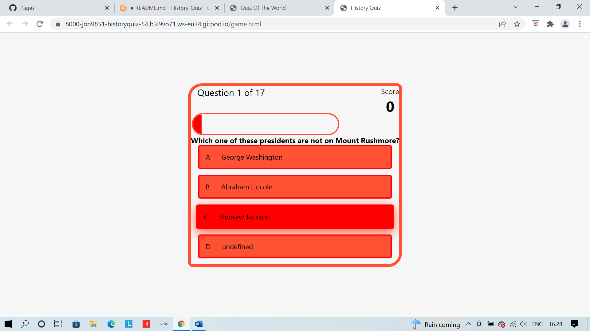

**_History Quiz_**
All credit and design for the html and javascrpit goes to BrianCodex

Welcome to your guide through History Quiz <a href="https://jon9851.github.io/History-Quiz/" target="_blank" rel="noopner">History Quiz</a>

# Contents

* [**User Experience UX**](<#user-experience-ux>)
  * [User Stories](<#user-stories>)
  * [Wireframes](<#wireframes>)
  * [Design Choices](<#design-choices>)
  * [Color Scheme](<#color-scheme>)
  * [**Features**](<#features>)
      * [Home](<#Home>)
      * [Insturctions](<#Instructions>)
      * [Game](<#Game>)
      * [Score](<#Score>)
      * [Buttons](<#Buttons>)
* [**Future Features**](<#future-features>)
* [**Technologies Used**](<#Technologies-Used>)
* [**Testing**](<#testing>)
* [**Deployment**](<#deployment>)
* [**Credits**](<#credits>)
* [**Content**](<#content>)
* [**Media**](<#media>)
* [**Acknowledgements**](<#acknowledgements>)                

# User Experience (UX)

## User stories

## Wireframes
The wireframes for ‘You Matter’ were produced in[Balsamiq](https://balsamiq.com).
There are frames for a full width display ( 1920 x 1080 )and a small mobile 
device (360 x 640). The final site varies slightly from the wireframes due to bugs and design 
changes during development that occurred during the creation process.
 

[Contents](<#contents>)

# Design Choices
 When designing the quiz of the world I wanted the quiz game to be simple and educational. The index page contains a brief introduction to the game, with three buttons directly underneath introduction paragraph. 
 
 A feature that I knew I was implementing early on was highlight option so that the user knew exactly where they where on the page and what buttons they were clicking. The quiz itself is a multiple-choice quiz as I knew the some of the question might be a bit difficult. Included in the game is a progress bar and a score counter so that the user can keep an eye on there score while playing the game.
 
 I hope that the users take away a bit of knowledge form playing the quiz of the world.

[Contents](<#contents>)

# Features
### Home
The quiz of the world is a simple quiz game that contains 3 buttons on the home page. Each button will take user to three different pages. The buttons will be highlighted once the user clicked on them, this so that the user and keep track of which page they are on.

### Instructions
The instructions page contains a summary of the games rules as well as button to return home.

### Game
The game contains multiple different features which are designed to help the user while playing the quiz of the world.

1.	Located on the top left is a question counter to help the user keep track of what question they are up too.
2.	Below the question counter is a progress bar which fills up as the user progress through the quiz.
3.	Located on the top right is a score counter which will help the user keep track of the scores. 
4.	
5.	The quiz it is self is a multiple-choice quiz with four possible answers with 17 questions in total.
6.	Each answer will change colour once selected. 

### Score
The score page has some text and a name box as well as two buttons which will either restart the quiz or take the user back to the home page. 

[Contents](<#contents>)

## Deployment

  ### **Deployment**

  The site was deployed using GitHub. THe following step will depoly You matter site.
  1. on the github repository, naviagte to **Settings** tab.
  2. Once on setting page, naviagte to **Pages** on the left hand side of the screen second from the bottom.
  3. Under **Source**, select the branch to **main**, then click **save**.
  4.  once you have selected the main branch, the page will be automatically refreshed with a detailed ribbon display to indicate the successful deployment. 
 
 
 
 # Technologies Used
   
* [HTML5](https://html.spec.whatwg.org/) -Used to create the contents and structure for the website.
* [CSS](https://www.w3.org/Style/CSS/Overview.en.html) -Used to create the styling.
* [Balsamiq](https://balsamiq.com/wireframes/) - Used to create the wireframes.
* [Gitpod](https://www.gitpod.io/#get-started) - Used to deploy the website.
* [Github](https://github.com/) - Used to host and edit the website code.

[Contents](<#contents>)

# Testing
 Please refer to [**_here_**](TESTING.md) for more information on testing 'You Matter'.

  
The live link will take you directly to **You Matter** repository - https://jon9851.github.io/You-Matter-/
  
  # Clone  Repository
   To Clone a repository use the following steps to guide you throught it.
   1. Under the repository’s name, click on the code tab.
   2. click on the clipboard icon to copy the given URL.
   3. In your IDE of choice, open Git Bash.
   4. Change the current working directory to the location where you want the cloned directory to be made.
   5. Type git clone, and then paste the URL copied from GitHub.
   6. Press enter and the local clone will be created.

   

[Contents](<#contents>)

### Credits
* The font used came from [Google Fonts](https://fonts.google.com/).
* The map used is from [Google Maps](https://www.google.com/maps).
* Balsamiq was used to create the wireframes [Balsamiq](https://balsamiq.com/)
* Font Awesome was used for the icons on You Matter. [Font Awesome](https://fontawesome.com/)
* All images contained with You Matter where uploaded on [Postimage](https://postimages.org/)

### Media
   * Images used came from [unsplash](https://unsplash.com/)
   * Videos used came from [youtube](http://youtube.com)

[Contents](<#contents>)

# Acknowledgements
 
 The site was cerated for my milestone project 1 for the [Code Institute](https://codeinstitute.net/) Full Stack Software Developer diploma. I would like to thank all the tutors at the code institute for their help during the development of my first milestone project. I would aslo like to thank [Precious Ijege](https://www.linkedin.com/in/precious-ijege-908a00168/) for his guidence and help as his feedback was extremely key in completing my first milestone project.