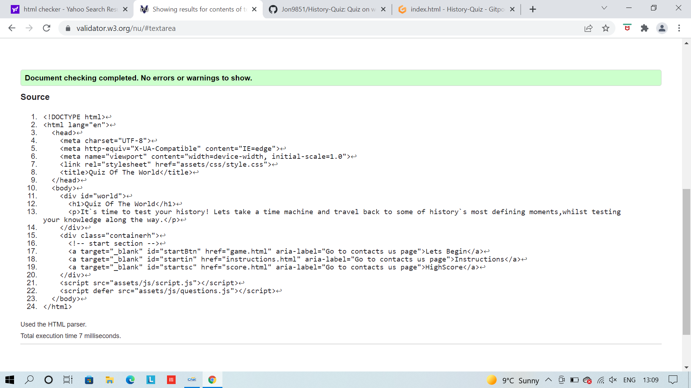

* [**Testing**](<#testing>)
* [**Manual Testing**](<#manual-testing>)
* [**Bugs**](<#bugs>)
* [**Accessibilty**](<#accessibilty>)
# Testing
W3C markup validator and W3C CSS validator were used to test and vailidate all the code on all 4  pages of history quiz to ensure that there were no syntax errors. JS hint was used to test the Javascrpit code.

 # index
 The image below is testing for the index.html file. No errors or warnings are visable. 

 # Instructions
 The image below is testing for the instructions.html file. No errors or warnings are visable. 

 # Game
 The image below is testing for the game.html file. No errors or warnings are visable. 

 # Score
 The image below is testing for the Score.html file. No errors or warnings are visable. 

# Manual Testing
The following images show manual testing accross completed across the project.

 
# BUGS
The orginal design for the history quiz has changed a lot due to bugs and learning curves i faced during the development of this project. 

  1. color change when user selects wrong answer  does not activate.
  2. Question choices appear to small on smaller devices they do not fill up the full page.
  3. Timer does not function correclty after 60seconds. questions should have skip once the timer has ran out.
  4. During testing users score didnt save feature removed.

# Accessibilty
Accessibilty was tested on lighthouse during the development of  history quiz. The results are distheplayed below.

